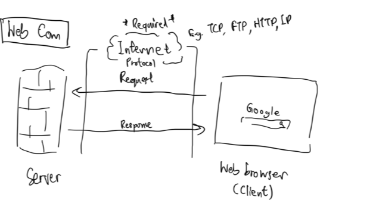
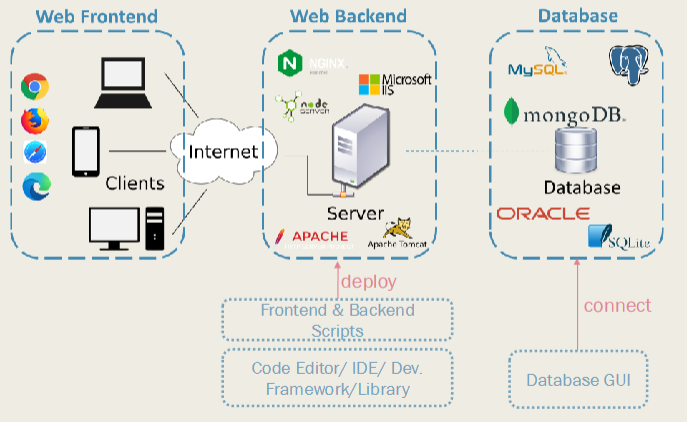

# Ch.1 Intro to Internet and Web Technology

## Web Communication

### ฝั่ง Client
1. User(Client) เชื่อมอินเตอร์เน็ต เมื่อต้องการ
2. User เปิด Web browser แล้วค้นหา/เข้าถึงเว็บไซต์ ใช้ HTTP(S) เป็น protocol
3. Web browser ทำการ Request ไฟล์หน้าเว็บจาก Server ผ่าน Internet Protocol
4. รับไฟล์ต่างๆ เช่น ไฟล์หน้าเว็บจาก Server

### ฝั่ง Server
1. เชื่อมอินเตอร์เน็ตอยู่ตลอด พร้อมกับมีการทำงานของ Web server เช่น Apache ซึ่งใช้ HTTP(S) เป็น protocol
2. รับ Request จาก Web browser
3. ส่งไฟล์ต่างๆ เช่น ไฟล์หน้าเว็บ status code ไปหา Client

### ฝั่ง Internet Protocol
- เป็นตัวกลางรับส่งไฟล์ ข้อมูลต่างๆ
- มีหลาย Protocol ทำงานร่วมกัน ขึ้นอยู่กับการใช้งาน

### Internet Infrastructure
- การติดต่อสื่อสารทั่วโลก ทำผ่าน Internet Backbone โครงสร้างพื้นฐานทางอินเตอร์เน็ตเหล่านี้มีบริษัท Internet Service Provider (ISP) เช่น AIS, 3BB หลายเจ้าเป็นเจ้าของ
- ข้อมูลจำนวนมากถูกส่งผ่านสาย fiber-optic ที่เชื่อมกันใต้ทะเล หรือผ่านดาวเทียม
- เราเชื่อมต่ออินเตอร์เน็ตกับ ISP เดียวก่อน จากนั้น ISP ก็จะพาเราไปเชื่อมต่อกับ ISP อื่นๆ
- Internet Infrastructure ทำให้เราสามารถรับการตอบกลับจาก server ได้แทบจะทันที

### Intranet and Extranet
- **Intranet** คืออินเตอร์เน็ตแบบ private ที่เชื่อมภายในองค์กร
- **Extranet** คืออินเตอร์เน็ตแบบ private ที่เชื่อมระหว่างองค์กร (กับหุ้นส่วนทางธุรกิจ)

### Terms
- **Network** คอมพิวเตอร์ 2 เครื่องขึ้นไปเชื่อมกันเพื่อติดต่อสื่อสาร และแลกเปลี่ยนข้อมูลทรัพยากรระหว่างกัน (ซึ่งทั้ง 2 เครื่องต้องอยู่ใน Network เดียวกัน)
- **Internet** = Global Network ใช้ TCP/IP protocol ในการเชื่อมต่อ
- **World Wide Web (WWW)** หน้าเว็บ/เอกสารที่อยู่ใน server User เข้าถึงได้ผ่านอินเตอร์เน็ต

### Web Standards
โดยหลักใช้ W3C (World Wide Web Consortium) ซึ่งหน้าเว็บต้องมี HTML, CSS และ JavaScript APIs 
 
การทำเว็บไซต์ตามมาตรฐานนี้ มีข้อดีคือ
- Support Accessibility (สำหรับคนพิการให้เข้าถึงเว็บได้)
- เว็บไซต์ทำงานได้ดีสม่ำเสมอใน Web browser ส่วนใหญ่
- Code ง่ายต่อการ Debug และ Maintenance เช่น ดู Error, code ที่ล้าหลัง (deprecated) แล้วผ่าน DevTools (กด F12)
- ป้องกันการเกิด bug และไม่พลาด feature ต่างๆ

### Internet Protocol
- **HTTP (Hyper Text Transfer Protocol)** แลกเปลี่ยนข้อมูลจำพวก ข้อความ รูปภาพ เสียง วิดีโอ เพื่อแสดงบนเว็บ มี method เช่น GET (ใช้เรียกไฟล์หน้าเว็บ), PUT, POST, etc.
- **FTP (File Transfer Protocol)** แลกเปลี่ยนไฟล์ระหว่างคอมพิวเตอร์กับอินเตอร์เน็ต มักใช้ในการ upload ไฟล์ที่เกี่ยวกับเว็บไซต์ไปที่ web server หรือใข้ดาวน์โหลดโปรแกรม/ไฟล์จาก server มาที่คอมพิวเตอร์ของเรา
- **Email Protocol**
    1. ใช้ส่ง Email: SMTP (Simple Mail Transfer Protocol)
    2. ใช้รับ Email: POP (POP3) - Post Office Protocol, IMAP - Internet Mail Access Protocol
- **TCP/IP (Transmission Control Protocol/Internet Protocol)**
    - TCP แบ่งข้อมูลเป็น packet ย่อยๆ
    - IP จะนำข้อมูลแต่ละ packet ไปที่ตำแหน่งที่ถูกต้องตาม IP Address อุปกรณ์ที่เชื่อมอินเตอร์เน็ตทุกเครื่องต้องมี IP Address ที่แตกต่างกัน ซึ่ง IP address จะประกอบไปด้วยกลุ่มของตัวเลข 4 กลุ่ม เรียกว่า octet เช่น 243.12.192.4

### Domain Name
- เป็นตัวระบุตำแหน่งคล้าย IP Address แต่เป็นรูปแบบข้อความที่มนุษย์อ่านเข้าใจ และจำได้ง่ายกว่า IP Address เช่น google.com
- **DNS (Domain Name Server)** แปลจาก Domain Name ไปเป็น IP Address

### URIs (Uniform Resource Identifier)
- ชุดตัวอักขระ (String) ระบุแหล่งข้อมูลบนอินเตอร์เน็ต
- URL (Uniform Resource Locator) เป็นประเภทที่พบเจอใช้มากที่สุด
- e.g. https://codingwithrand.vercel.app/lounge

<table>
    <tr>
        <th>Part</th>
        <th>Meaning</th>
    </tr>
    <tr>
        <td>https</td>
        <td>Protocol</td>
    </tr>
    <tr>
        <td>codingwithrand.vercel.app</td>
        <td>Domain Name</td>
    </tr>
    <tr>
        <td>/lounge</td>
        <td>ที่อยู่ของหน้าเว็บ/ไฟล์ข้อมูล</td>
    </tr>
</table>

- **TLD (Top-Level Domain Name)** อยู่ที่ด้านขวาสุดของ Domain Name เช่น .com, .net, .biz และมีแบบที่เป็น Country Code บอกว่าเว็บนี้มาจากประเทศไหนด้วย เช่น .th (ประเทศไทย), .uk (สหราชอาณาจักร)

## Web Development

### Web Browser
ซอฟต์แวร์ที่เรียกไฟล์ข้อมูลเว็บไซต์ แสดงไฟล์ข้อมูลเว็บไซต์ และนำผู้ใช้ไปสู่ไฟล์ข้อมูลเว็บไซต์ ้โดยการแปลภาษา HTML, CSS และแสดงหน้าเว็บให้เห็น ตัวอย่างเช่น Google Chrome, Microsoft Edge, Firefox, Safari
### View Page Source
กดคลิกขวาบนหน้าเว็บ > View Page Source จะเห็นโครงสร้างโค้ด HTML ที่มี tag เช่น \<html\>, \<head\>
### Developer Tools
กดคลิกขวาบนหน้าเว็บ > Inspect หรือกดบนคีย์บอร์ด F12
- **Inspect/Elements** ดู HTML elements และโค้ด CSS 
- **Console** ดูข้อความที่ส่งมาจากโค้ด JavaScript และรันโค้ด JavaScript
- **Network** ติดตาม request/response ระหว่าง Client กับ Server
### IDE (Integrated Development Environment)
ใช้ Visual Studio Code (VS Code)