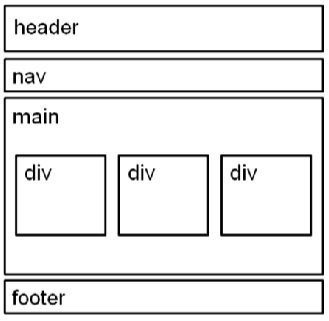
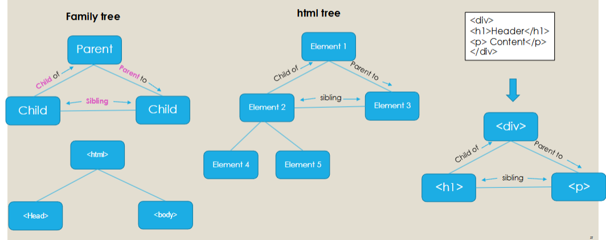
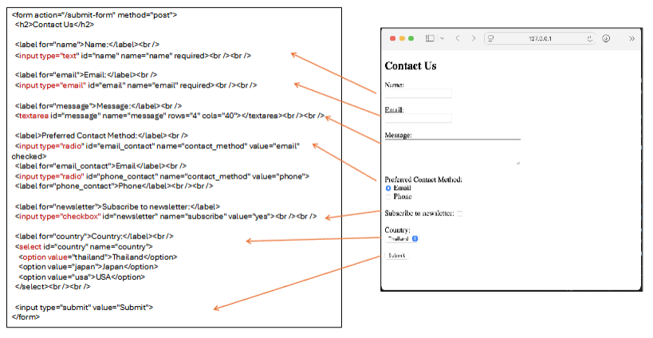

# Chapter 2 Mark up language & HTML

## ส่วนประกอบ Mark up language
1. Tag = \<ชื่อ function\>
2. Tag เปิด = \<ชื่อ function\>
3. Tag ปิด = \</ชื่อ function\>
4. 1 element มี tag เปิด และมี tag ปิด (บาง element อาจไม่มี tag ปิด)
5. บาง element มี attribute เพื่อให้ข้อมูลเพิ่มเติมเกี่ยวกับ element เช่น \<tag attributeName="value"\>
6. เนื้อหาระหว่าง tag เปิด และ tag ปิด เรียกว่า content เช่น \<p\>Lorem Ipsum\</p\> คือ element p ที่มี content เป็น Lorem Ipsum
7. \<!DOCTYPE เวอร์ชันและภาษาของ Mark up\> กำหนดว่าไฟล์นี้ใช้ภาษา Mark up อะไร และเวอร์ชันอะไร เช่น \<!DOCTYPE html\> คือไฟล์นี้ใช้ภาษา HTML5
8. การ Nesting และ Indentation: เราสามารถใส่ element อื่นเป็น content ของ element นึงได้ เรียกว่า Nesting ซึ่งเพื่อให้ง่ายต่อการอ่านโค้ด เมื่อ Nest แล้ว จะต้องขึ้นบรรทัดใหม่แล้วกด space bar 2-4 ครั้ง เพื่อแบ่งโครงสร้างแต่ละ element อย่างชัดเจนว่าใครเป็น parent ใครเป็น child ใครเป็น sibling เรียกว่า Indentation แต่ถึงแม้ไม่ทำ หน้าเว็บก็ยังแสดงได้ปกติ แค่โค้ดอ่านยากเฉยๆ
    ```html
    <!-- Nest และ Indent โค้ดอ่านง่าย -->
    <div>
        <p>Lorem</p>
    </div>
    ```
    ```html
    <!-- Nest แต่ไม่ Indent โค้ดอ่านยากขึ้น แต่หน้าเว็บยังทำงานได้ปกติ -->
    <div>
    <p>Lorem</p>
    </div>
    ```

### เพิ่มเติม
**Computer as a Server** คือคอมพิวเตอร์เราเปิดเป็นเซิร์ฟเวอร์ มี IP address 127.0.0.1 และ Domain Name localhost
**Port** เป็นช่อง (Channel) ที่ระบุให้คอมพิวเตอร์ใช้ติดต่อกับอุปกรณ์อื่น ตัวอย่างเช่น http://localhost:3000 ใช้ port 3000 ในการติดต่อ Default Port สำหรับ www คือ 80 จึงไม่จำเป็นต้องระบุ port

## ตัวอย่าง Mark up language
### HTML (Hyper Text Markup Language)
ใช้สำหรับหน้าเว็บ ตอนนี้เป็นเวอร์ชัน HTML5
### XML (eXtensible Markup Language)
- ใช้แสดง อธิบาย แลกเปลี่ยน และเก็บข้อมูลอย่างเป็นโครงสร้าง
- ใช้เป็นส่วนขยายของ HTML เพื่อแยกข้อมูลออกจากโครงสร้างที่แสดงบนหน้าเว็บ

<table>
    <tr><th>Bookshelf</th></tr>
    <tr><td>Industrial Society and its Consequences</td></tr>
    <tr><td>Frieren: Beyond Journey's End Vol.1</td></tr>
</table>

```xml
    <bookshelf>
        <book>Industrial Society and its Consequences</book>
        <book>Frieren: Beyond Journey's End Vol.1</book>
    </bookshelf>
```
### XHTML (eXtensible Hyper Text Markup Language)
ผสมระหว่าง HTML กับ XML มีวัตถุประสงค์หลักคือเพื่อให้อุปกรณ์อื่นๆสามารถเข้าถึงเว็บได้ XHTML ช่วยให้นักพัฒนาเว็บผสมผสานการโค้ดใน HTML กับ XML และสามารถปรับใช้ XML ในโค้ดได้

```xhtml
<!DOCTYPE html PUBLIC "-//W3C//DTD XHTML 1.1//EN" "http://www.w3.org/TR/xhtml11/DTD/xhtml11.dtd">
<html xmlns="http://www.w3.org/1999/xhtml">
<head>
  <title>Title of document</title>
</head>
<body>

  some content here...

</body>
</html>
```

## โครงสร้าง HTML
### Head
เนื้อหาใน \<head\> จะไม่แสดงบนหน้าเว็บ แต่จะประกอบไปด้วยข้อมูลที่อธิบายหน้าเว็บ ให้หน้าเว็บแสดงได้อย่างถูกต้อง และเชื่อมไฟล์ต่างๆเข้ากับตัวหน้าเว็บ <br>
Element ที่อยู่ใน \<head\> ได้แก่ \<meta\>, \<title\>, \<link\>, \<style\>, \<script\>
```html
<head>
    <meta charset="UTF-8">
    <!-- ให้เว็บใช้รูปแบบตัวอักษรเป็น utf-8 ซึ่งเป็นมาตรฐานสากล -->

    <meta name="viewport" content="width=device-width, initial-scale=1.0">
    <!-- 
        ให้แนวทางการควบคุมขนาดของหน้าเว็บ (viewport) โดย
        width=device-width คือกำหนดให้ความกว้างหน้าเว็บเป็นไปตามความกว้างหน้าจออุปกรณ์
        initial-scale=1.0 คือกำหนดให้ตอนเข้าเว็บมาให้ zoom 1 เท่า
    -->

    <meta name="description" content="My CV Assignment for CAMT SE">
    <meta name="keywords" content="CV">
    <meta name="keywords" content="Resume">
    <meta name="keywords" content="Software Engineer">
    <meta name="keywords" content="Junior Developer">
    <!--
        กำหนดคำอธิบาย (description) หรือคำสำคัญ (keywords) ของเว็บไซต์ สำหรับการทำ SEO ให้ Search Engine มีโอกาสแสดงหน้าเว็บของเราตอนผู้ใช้ค้นหามากขึ้น
    -->

    
    <title>My CV Assignment</title>
    <!-- ชื่อหน้าเว็บแสดงบนแท็บ -->

    <link rel="icon" href="/favicon.ico">
    <!-- แสดงไอคอนของหน้าเว็บ -->

    <link rel="stylesheet" type="text/css" href="./styles.css">
    <!-- นำเข้าไฟล์ External CSS มาใช้กับหน้าเว็บ -->

    <style>
        /* Other styles go here. */
    </style>
    <!-- กำหนด Embed CSS ที่ใช้กับหน้าเว็บนี้เท่านั้น -->

    <script src="scripts.js"></script>
    <!-- นำเข้าไฟล์ JavaScript มาใช้กับหน้าเว็บ -->
</head>
```

### Body
ประกอบไปด้วยเนื้อหาที่จะแสดงบนหน้าเว็บ การวางโครงสร้างที่ดีควรเป็นดังนี้ <br>
Code
```html
<body>
    <header></header>
    <nav></nav>
    <main>
        <div></div>
        <div></div>
        <div></div>
    </main>
    <footer></footer>
</body>
```
Result



แผนภาพต้นไม้ของโครงสร้าง HTML แต่ละ element



### Phrase Elements
- **\<b\>, \<strong\>** แสดงตัวอักษรเป็นแบบตัวเข้ม โดย \<b\> กับ \<strong\> ต่างกันเล็กน้อยตรงที่ว่าวัตถุประสงค์ของ \<strong\> จะทำให้ตัวอักษรโดดเด่น (โดยทำให้เป็นตัวเข้ม) แต่ \<b\> จะทำให้เป็นตัวเข้มเฉยๆ ไม่มีวัตถุประสงค์อื่น
- **\<i\>, \<em\>** แสดงตัวอักษรเป็นแบบตัวเอียง โดย \<i\> กับ \<em\> ต่างกันเล็กน้อยตรงที่ว่าวัตถุประสงค์ของ \<em\> จะเน้นตัวอักษร (โดยทำให้เป็นตัวเอียง) แต่ \<i\> จะทำให้เป็นตัวเอียงเฉยๆ ไม่มีวัตถุประสงค์อื่น
- **\<small\>** แสดงตัวอักษรที่เล็กกว่าปกติ
- **\<sup\>** แสดงตัวอักษรตัวเล็กเยื้องไปด้านบน
- **\<sub\>** แสดงตัวอักษรตัวเล็กเยื้องไปด้านล่าง
- **\<mark\>** แสดงข้อความที่มีไฮไลท์สีเหลือง

### Quotation Elements
- **\<blockquote\>** แสดงบล็อกของข้อความ quote เช่น คติของคนดัง โดยจะมีการเยื้องข้อความมาทางซ้ายและขวา <br>
    Code
    ```html
    <p>Lorem</p>
    <blockquote>
        <p>Quote</p>
    </blockquote>
    <p>Ipsum</p>
    ```
    Result
    ```
    Lorem
        Quote
    Ipsum
    ```
- **\<q\>** แสดงข้อความ quote ที่สั้นลงมา จะมีการใส่ "" ล้อมรอบข้อความใน \<q\>

### List Elements
- **\<li\>** รายการใน list
- **\<ol\>** Ordered List <br>
    Code
    ```html
        <ol>
            <li>Frieren: Beyond Journey's End Vol.1</li>
            <li>Frieren: Beyond Journey's End Vol.2</li>
            <li>Frieren: Beyond Journey's End Vol.3</li>
            <li>Frieren: Beyond Journey's End Vol.4</li>
        </ol>
    ```
    Result
    1. Frieren: Beyond Journey's End Vol.1
    2. Frieren: Beyond Journey's End Vol.2
    3. Frieren: Beyond Journey's End Vol.3
    4. Frieren: Beyond Journey's End Vol.4

- **\<ul\>** Unordered List
    Code
    ```html
        <ul>
            <li>Library of Ruina: Angela Realization</li>
            <li>Library of Ruina: Roland Realization</li>
        </ul>
    ```
    Result
    * Library of Ruina: Angela Realization
    * Library of Ruina: Roland Realization

- **\<dl\> Description List, \<dt\> Description Term, \<dd\> Description** <br>
    แสดง List ที่อธิบายคำ (Term) ต่างๆ หรือใช้ทำ FAQ กับ answers <br>
    Code
    ```html
        <dl>
            <dt>HTML</dt>
            <dd>Hyper Text Markup Language</dd>
            <dt>CSS</dt>
            <dd>Cascading Styles Sheet</dd>
        </dl>
    ```
    Result
    ```
        HTML
            Hyper Text Markup Language
        CSS
            Cascading Styles Sheet
    ```
- **Note**: เราสามารถ Nest \<ul\> หรือ \<ol\> ต่างๆใน \<li\> เพื่อทำ sub-list หรือ nested list ได้

### Table Element
แสดงตาราง ประกอบด้วย ตัวตาราง \<table\>, แถวตาราง \<tr\>, หัวตาราง \<th\> และข้อมูลในตาราง \<td\> <br>
Code
```html
    <table>
        <tr>
            <th>Manga</th>
            <th>Music</th>
        </tr>
        <tr>
            <td>Frieren: Beyond Journey's End</td>
            <td>Frieren: Beyond Journey's End - Waltz for Stark and Fern</td>
        </tr>
        <tr>
            <td>My Gift Lvl 9999 Unlimited Gacha</td>
            <td>Library of Ruina - Gone Angels</td>
        </tr>
    </table>
```
Result
<table>
    <tr>
        <th>Manga</th>
        <th>Music</th>
    </tr>
    <tr>
        <td>Frieren: Beyond Journey's End</td>
        <td>Frieren: Beyond Journey's End - Waltz for Stark and Fern</td>
    </tr>
    <tr>
        <td>My Gift Lvl 9999 Unlimited Gacha</td>
        <td>Library of Ruina - Gone Angels</td>
    </tr>
</table>

### Hyperlink
```html 
<a href="https://example.com" target="_blank"\>
```
- สร้างลิงค์ที่คลิกแล้วไปยังหน้าเว็บต่างๆ ทั้งของเว็บไซต์เราและของเว็บไซต์คนอื่นได้ โดยกำหนด url ของหน้าเว็บนั้นๆใน attribute "href"
- การลิงค์ในหน้าเว็บของเว็บไซต์เรา แนะนำให้ใช้ relative path โดยไม่ต้องใส่ domain name เข้าไปใน href
    - Web browser จะทำการค้นหาไฟล์ในโฟลเดอร์หน้าเว็บที่เราเปิดอยู่ หากเราใส่ <mark>**_"ชื่อไฟล์"_**</mark> หรือใส่ <mark>**_"./ชื่อไฟล์"_**</mark> ใน href
    - Web browser จะทำการค้นหาไฟล์ในโฟลเดอร์ parent ของ โฟลเดอร์หน้าเว็บที่เราเปิดอยู่ หากเราใส่ <mark>**_"../ชื่อไฟล์"_**</mark> ใน href
    - Web browser จะทำการค้นหาไฟล์ในโฟลเดอร์หลัก (root) ของเว็บไซต์ หากเราใส่ <mark>**_"/ชื่อไฟล์"_**</mark> ใน href
- การลิงค์ในหน้าเว็บของเว็บไซต์เรา แนะนำให้ใช้ absolute path (Copy url มาวางใน href เลย)
- Email Hyperlink จะทำการเปิดโปรแกรมอีเมลเพื่อที่จะเริ่มอีเมลไปหาบัญชีอีเมลที่ระบุไว้ ใส่ _mailto:อีเมล_ ใน href
- การลิงค์ในหน้าเดียวกัน ก่อนอื่นจะต้องกำหนด attribute "id" ให้กับ element ที่จะลิงค์ไปหาก่อน แล้วจึงใส่ #id ใน href
- taget="_blank" จะเปิดหน้าเว็บในแท็บใหม่

### Image
```html

```
แสดงรูปภาพ มี attribute ดังนี้
- **src** ชื่อ/ที่อยู่ไฟล์รูปภาพ
- **alt** กำหนดคำอธิบายรูปภาพ ซึ่งก็คือข้อความที่จะแสดงตอนรูปภาพไม่โหลด
- **height** กำหนดความยาวของรูปภาพในหน่วย px
- **width** กำหนดความกว้างของรูปภาพในหน่วย px
- **Note**
    - สามารถ Nest \ ใน \<a\> เพื่อทำรูปภาพที่สามารถลิงค์ไปหน้าเว็บต่างๆได้
    - Image formats ได้แก่
        1. **JPEG** รูปถ่าย รูปเสมือนจริง มีสีสัน ความคมชัดสูง เมื่อบีบอัดแล้วอาจสูญเสียข้อมูลบางส่วนได้ (lossy conpression)
        2. **PNG** ทำพื้นหลังใสได้ เหมาะกับทำ logo, web graphic, รูปที่มีข้อความ
        3. **GIF** รูปมีสีได้สูงสุดแค่ 256 สี สามารถเล่นภาพเคลื่อนไหวพื้นฐานได้
        4. **WebP** รูปแบบปัจจุบัน สามารถบีบอัดแล้วกลับคืนมาเป็นรูปเดิมก็ได้ (lossless conpression) หรือไม่ก็ได้ (lossy conpression) เล่นภาพเคลื่อนไหว และทำพื้นหัลงใสได้ อีกทั้งขนาดไฟล์ยังน้อยกว่า JPEG และ PNG
        5. **SVG** - Scale Vector Graphics มักใช้ทำ icon หรือ logo สามารถกำหนด style โดยใช้ CSS และเล่นอนิเมชันได้ด้วย JavaScript
    - คำแนะนำในการใส่ภาพคือ เลือกรูปแบบ (format) ที่เหมาะสม และเลือกขนาด (size) กับความคมชัด (resolution) ของภาพตามที่ต้องการจะให้แสดงบนหน้าเว็บเพื่อให้รูปโหลดเร็วขึ้น และลดการใช้ bandwidth
    - ความคมชัดที่มากขึ้นจะทำให้ไฟล์มีขนาดใหญ่ขึ้น โดยรูปภาพที่จะใช้บนหน้าเว็บควรมีความคมชัดอยู่ที่ 72 ppi (pixels per inch)

### Form
ใช้เก็บข้อมูล User ประกอบไปด้วย elements เช่น
1. Text fields สำหรับเก็บข้อมูลพวกชื่อหรือ email
2. Radio buttons and Checkbox buttons ให้ผู้ใช้เลือกตัวเลือก 1 ตัวเลือก (Radio) หรือหลายตัวเลือก (Checkbox)
3. Textarea สำหรับเก็บข้อความยาวๆจากผู้ใช้
4. Dropdown Menu ให้ผู้ใช้เลือกตัวเลือกใน dropdown
5. Submit Button กดส่งข้อมูลใน form


<form action="/submit-form" method="post">
    <h2>Contact Us</h2>
    <label for="name">Name:</label><br />
    <input type="text" id="name" name="name" required><br /><br />
    <label for="email">Email:</label><br />
    <input type="email" id="email" name="email" required><br /><br />
    <label for="message">Message:</label><br />
    <textarea id="message" name="message" rows="4" cols="40"></textarea><br /><br />
    <label>Preferred Contact Method:</label><br />
    <input type="radio" id="email_contact" name="contact_method" value="email"
    checked>
    <label for="email_contact">Email</label><br />
    <input type="radio" id="phone_contact" name="contact_method" value="phone">
    <label for="phone_contact">Phone</label><br /><br />
    <label for="newsletter">Subscribe to newsletter:</label>
    <input type="checkbox" id="newsletter" name="subscribe" value="yes"><br /><br />
    <label for="country">Country:</label><br />
    <select id="country" name="country">
    <option value="thailand">Thailand</option>
    <option value="japan">Japan</option>
    <option value="usa">USA</option>
    </select><br /><br />
    <input type="submit" value="Submit">
</form>

การทำงานของ form คือ
1. ผู้ใช้กรอกข้อมูล แล้วกดปุ่ม submit
2. ค่าข้อมูลในแต่ละช่องพร้อมชื่อของช่อง ซึ่งเอาไว้ชี้ว่าข้อมูลช่องนี้อยู่ไหนถูกส่งไปหา server
3. Server ประมวลผล ด้วยภาษาโปรแกรมมิ่ง เช่น PHP, C#, Java
4. Server สร้างหน้าเพจใหม่แล้วส่งกลับมา 

Attribute ของ form ได้แก่
1. **action** ส่งข้อมูลใน form ไปที่ไหน ระบุใน action ("#" หมายถึงส่งมาที่หน้าเดิมที่มี form อยู่)
2. **method** get หรือ post
    - _get_ ข้อมูลจะถูกเพิ่มเข้าไปใน URL เหมาะสำหรับ form สั้นๆ จำพวก search bar ซึ่งข้อมูลไม่ได้มีความสำคัญมาก ไม่มีการเปลี่ยนแปลงข้อมูลใน server
    - _post_ ส่งข้อมูลผ่าน HTTP(s) ไปหา server ใช้ก็ต่อเมื่อ form ยาว มีข้อมูลที่สำคัญเยอะ การอัปโหลดไฟล์ และมีการเปลี่ยนแปลงข้อมูลใน server
3. **id** กำหนด id ของ form ที่แตกต่างกัน ให้ JavaScript สามารถแยกออกได้

### Other Elements
- **\<h1\> ถึง \<h6\>** แสดงหัวข้อ 6 ระดับ ความใหญ่ตัวอักษรลดหลั่นลงมา (1 ใหญ่สุด 6 เล็กสุด)
- **\<p\>** แสดงข้อความยาว ที่รวมหลายๆประโยคเข้าด้วยกัน
- **\<br\>** ขึ้นบรรทัดใหม่ให้กับข้อความหรือ element เพราะใน HTML กด Enter ไม่ได้แปลว่าจะขึ้นบรรทัดใหม่
- **\<hr\>** เส้นบางยาวแนวนอน ใช้กั้นระหว่าง section ต่างๆ
- **\<abbr title="..."\>** ใช้แสดงคำย่อ ข้อความนั้นจะมีเส้นใต้เป็นจุดไข่ปลา และจำเป็นต้องใส่คำเต็มใน attribute "title" ด้วย
- **\<cite\>** ใช้แสดงแหล่งอ้างอิงจากภายนอก โดยหน้าเว็บจะแสดงเป็นตัวหนังสือเอียง
- **\<dfn\>** ใช้แสดงคำที่กำหนดขึ้นใหม่ (New term) โดยหน้าเว็บจะแสดงเป็นตัวหนังสือเอียง
- **\<address\>** ใช้แสดงช่องทางการติดต่อของเจ้าของหน้าเว็บ element ภายใต้ \<address\> ทั้งหมดจะแสดงเป็นตัวอักษรเอียง
- **\<div\>** นิยมใช้รวมกลุ่ม element อื่นๆ เข้าด้วยกันเป็น block เดียว และแบ่งเนื้อหาของเว็บเป็นส่วนๆ
- **\<span\>** ใช้ร่วมกับ CSS เพื่อทำเพิ่มลักษณะเฉพาะกับตัวอักษร หรือกลุ่มคำใน ข้อความ
- **\<figure\>** ใช้รวม \<figcaption\> กับ \ เป็นบล็อกเดียว สามารถใส่ได้หลาย \ หากมี \<figcaption\> เดียวกัน
- **\<figcaption\>** แสดงข้อความคำอธิบายใต้รูปภาพ ใช้ใน \<figure\>
- **\<iframe width="400" height="300" src="https://youtube.com"\>** แสดงหน้าเว็บอื่นในหน้าเว็บของเรา โดยสามารถกำหนดความกว้าง ความยาวของ \<iframe\> ได้ และใส่ลิงค์หน้าเว็บอื่นใน attribute "src"