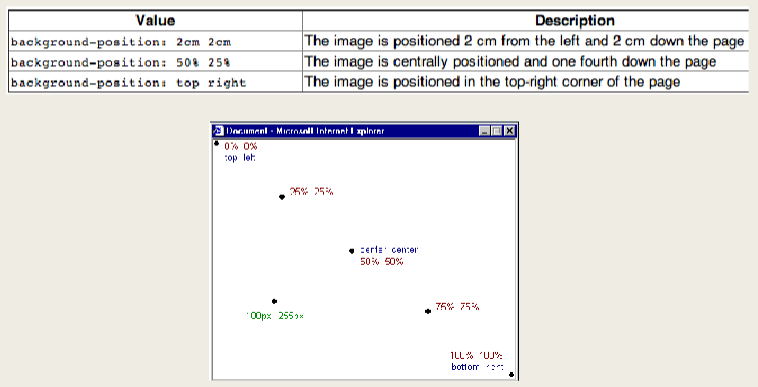
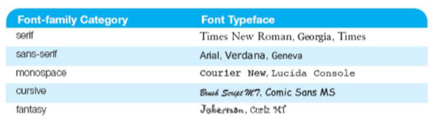
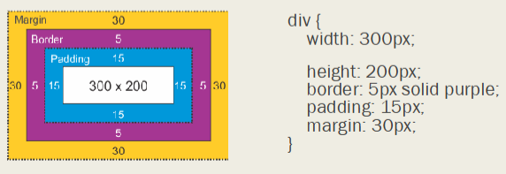
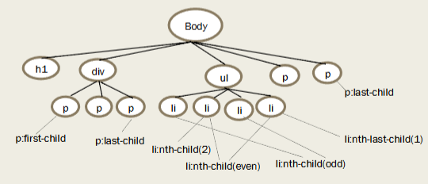

# Ch.3 CSS
## ทำไมต้องใช้ CSS?
HTML เป็นเสมือนแก่นโครงสร้าง ทำให้รู้ว่า นี่คือหัวเรื่อง (heading) นี่คือ paragraph ในขณะที่ CSS (Cascading Style Sheets) เป็นตัวจัดรูปแบบโครงสร้างนั้นให้สวยงาม มีสไตล์ จัดเค้าโครงหน้าเว็บให้มีระบบระเบียบมากขึ้น ไฟล์ CSS 1 ไฟล์สามารถปรับปรุงหน้าเว็บได้หลายหน้าเว็บ

## การใช้งาน CSS
1. Inline CSS ใส่ข้อมูล CSS property เข้าไปใน attribute "style" ของ HTML element โดยตรง style นั้นจะส่งผลแค่ element นั้น ไม่สามารถนำมาใช้ซ้ำได้ เหมาะกับการทดสอบ style หรือใส่ style สำหรับ element นั้นเท่านั้น
2. Embedded CSS กำหนด style ใน element \<style\> จะส่งผลต่อไฟล์ HTML นั้นทั้งไฟล์ เหมาะกับโปรเจกต์ที่มีหน้าเว็บหน้าเดียว
3. External CSS กำหนด style ในไฟล์ ".css" แล้วจึงนำเข้าด้วย \<link\> ทำให้ 1 ไฟล์สามารถใส่ style ได้กับหลายไฟล์ HTML เหมาะกับโปรเจกต์ใหญ่ๆ

**ลำดับความสำคัญ** (style ที่สำคัญกว่าจะแสดงบนหน้าเว็บแทน style ที่สำคัญน้อยกว่า) <br>
Inline > Embedded > External > Browser Default

## CSS Property
### สีใน CSS
1. ใช้สี RGB ในรูปแบบเลขฐาน 16 (Heximal Number) e.g. `#FF0000` = สีแดง โดย `FF` คือค่าสีแดง 255 `00` แรกคือค่าสีเขียว 0 และ `00` แรกคือค่าสีน้ำเงิน 0
2. ใช้ฟังก์ชัน `rgb(ค่าสีแดง, ค่าสีเขียว, ค่าสีน้ำเงิน)` หรือ `rgba(ค่าสีแดง, ค่าสีเขียว, ค่าสีน้ำเงิน, ค่าความโปร่งใส)` โดยค่าสีอยู่ระหว่าง 0-255 ส่วนค่าความโปร่งใสอยู่ระหว่าง 0 (โปร่งใส) - 1 (สีปกติ)
3. พิมพ์ชื่อสี เช่น `red`, `yellow`, `green`

* `color` ใส่สีตัวอักษร ข้อความ

### Background
`background` แตกออกเป็น property ย่อยๆ ได้ตามลำดับนี้

* `background-color` ใส่สีพื้นหลัง
* `background-image` ใส่ภาพพื้นหลัง ที่อยู่รูปภาพใส่ใน `url("/img/path/here")`
* `background-repeat` กำหนดให้ภาพซ้ำในแนวนอน (repeat-x) แนวตั้ง (repeat-y) ทั้ง 2 แนว (repeat) หรือไม่ซ้ำ (no-repeat)
* `background-attachment`
* `background-position` กำหนดตำแหน่งของรูปภาพ


### Font
* `font-family` ปรับฟอนต์ตัวอักษร ข้อความ

* `font-weight` ปรับน้ำหนัก ความเข้ม ความจางของตัวอักษร (bold, bolder, lighter, normal / 100 - 900)
* `font-style` ปรับรูปแบบ เช่น เป็นตัวเอียง (italic)
* `font-size` ปรับขนาดตัวอักษร (xx-small, x-small, smaller, small, medium, large, larger, x-large, xx-large, xxx-large / ค่าตัวเลขในหน่วยต่างๆ)

### Box Model
ให้มองแต่ละ HTML element เป็นเหมือนกล่อง Box Model คือกล่องแต่ละกล่องที่ล้อม HTML element ไว้รวมถึงตัว element เอง ประกอบไปด้วย content ใน element, padding, borders และ margins



การกำหนดค่าของ box model เหล่านี้ จะกำหนดเป็น ค่าตัวเลขในหน่วยต่างๆ
- **Content** เนื้อหาใน element เช่น ข้อความ หรือรูปภาพ
    - `width` กำหนดความกว้าง
    - `height` กำหนดความยาว
- **Padding** พื้นที่โล่งๆ รอบๆ content ให้ค่าได้หลายแบบ
    - `padding: 10px` พื้นที่โล่งๆ รอบๆ content 10 พิกเซล
    - `padding: 10px 0` พื้นที่โล่งด้านบน และล่าง content 10 พิกเซล
    - `padding: 0 10px` พื้นที่โล่งด้านซ้าย และขวา content 10 พิกเซล
    - `padding: 1px 2px 3px 4px` พื้นที่โล่งด้านบน 1 พิกเซล ขวา 2 พิกเซล ล่าง 3 พิกเซล และซ้าย 4 พิกเซล รอบ content
    - หรือกำหนด padding ด้านใดด้านนึงโดยเฉพาะ: `padding-top`, `padding-left`, `padding-bottom`, `padding-right`
- **Borders** เส้นขอบล้อม padding กับ content ไว้ ให้ค่าได้หลายแบบเหมือน padding
- **Margins** พื้นที่โล่งนอกเส้นขอบ ให้ค่าได้หลายแบบเหมือน padding

**เทคนิค** ตั้ง `margin: 0 auto` เพื่อทำให้ element อยู่ตรงกลางในแนวนอน

**box-sizing** ตั้งเป็น `content-box` (ค่าเริ่มต้น) หรือ `border-box` (แนะนำ เพราะง่ายกว่าต่อการจัดเค้าโครง)
- `content-box` การกำหนดขนาดของ element ด้วย `width` และ `height` จะกำหนดที่ `content` เท่านั้น หากมีการใส่ padding หรือ border เพิ่มเติม ขนาด element ก็จะใหญ่ขึ้น ซึ่งจะไม่ตรงกับที่กำหนดใน `width` และ `height` ตอนแรก
- `border-box` การกำหนดขนาดของ element ด้วย `width` และ `height` จะกำหนดที่ `content` รวมกับ `padding` และ `border` ด้วย ซึ่งขนาดของ `content` จะปรับตามขนาด `padding` และ `border` ที่มี


### Display
`display`: 
* `block` กินเนื้อที่ทั้งบรรทัด และ element ถัดไปจะขึ้นบรรทัดใหม่เสมอ element ที่มี `display: block` เป็นค่าเริ่มต้น เช่น \<p\>, \<h1\> - \<h6\>, \<div\>, \<ol\>, \<ul\>, \<li\>, \<form\>
* `inline` element ถัดไปจะแสดงต่อกันเลย การกำหนด `width` และ `height` จะไม่มีผลต่อ element element ที่มี `display: inline` เป็นค่าเริ่มต้น เช่น \<span\>, \, \<a\>
* `inline-block` element ถัดไปจะแสดงต่อกัน และสามารถกำหนด `width` และ `height` ให้ element ได้
* `none` element โดนลบทิ้งออกจากหน้าเว็บเพจโดยสมบูรณ์ (Note: `display: none` ≠ `visibility: hidden` ตรงที่ `visibility: hidden` จะเพียงทำให้ element ล่องหน มองไม่เห็นเฉยๆ แต่ยังอยู่บนหน้าเว็บ)

### Display Flex
`display: flex` เป็นกล่องที่สามารถยืดหยุ่นได้ในแนวนอน 1 แถว หรือแนวตั้ง 1 แถว (1 มิติ) element ด้านในสามารถหด (`flex-shrink`) ขยาย (`flex-grow`) ปรับตำแหน่งได้
- `flex-direction` ตั้งเป็น `row` สำหรับแนวนอน หรือ `column` สำหรับแนวตั้ง
- `justify-content` ปรับตำแหน่งในแนวนอนสำหรับ `flex-direction: column` ปรับตำแหน่งในแนวตั้งสำหรับ `flex-direction: row` มีค่า เช่น `center`, `flex-start`, `flex-end`, `space-between`, `space-around`
- `align-items` ปรับตำแหน่งในแนวตั้งสำหรับ `flex-direction: column` ปรับตำแหน่งในแนวนอนสำหรับ `flex-direction: row` เช่น `center`, `flex-start`, `flex-end`
- `gap` กำหนดช่องว่างระหว่าง child element เป็นค่าตัวเลขในหน่วยต่างๆ
    - `column-gap` ช่องว่างระหว่างคอลัมน์ ใช้กับ `flex-direction: row`
    - `row-gap` ช่องว่างระหว่างแถว ใช้กับ `flex-direction: column`

### Position
`position:`
- `static` ค่าเริ่มต้นของทุก HTML element ตำแหน่งของ element จะเป็นไปตามการจัดวางปกติของหน้าเว็บ ไม่ถูกผลของ property `top`, `left`, `bottom`, `right`
- `relative` คล้ายๆ `static` แต่ได้รับผลของ property `top`, `left`, `bottom`, `right` โดยตำแหน่งจะอ้างอิงจากตำแหน่งเดิมของ element และ element ที่เคลื่อนจะไม่ส่งผลกระทบกับ element อื่นๆ
- `absolute` ตำแหน่งจะอ้างอิงจาก ancestor element (parent element หรือ element ที่อยู่เหนือจากนั้น) ที่มีการกำหนด `position` ที่ไม่ใช่ `static` ที่ใกล้ที่สุด หากไม่มีจะอ้างอิงกับ \<body\> ตำแหน่งของ element จะถูกเอาออกจากการจัดวางปกติของหน้าเว็บ element สามารถซ้อนกันได้
- `fixed` ตำแหน่งจะอ้างอิงกับหน้าเว็บ (viewport) ซึ่ง element จะแสดงบนหน้าเว็บที่เดิมตลอด แม้จะเลื่อนลงหน้าเว็บขึ้นหรือลงมาก็ตาม

`z-index: ตัวเลข` จัดลำดับว่า element ไหนอยู่หน้าสุด ไม่ทำงานกับ `position: static`
- เลขค่าสูง = อยู่ด้านหน้า = แสดงบนหน้าเว็บทับ element ที่มีเลขค่าต่ำกว่า
- เลขค่าต่ำ = อยู่ด้านหลัง = ถูก element ที่มีเลขค่าสูงกว่าแสดงทับ

### Display Grid
`display: grid` เป็นกล่องที่สามารถยืดหยุ่นได้ในแนวนอนและแนวตั้ง (2 มิติ) เหมาะสำหรับการทำเค้าโครงแบบ Dashboard
- `grid-template-columns` กำหนดว่ามีกี่คอลัมน์ ขนาดเท่าไร เช่น `100px 200px` คือมี 2 คอลัมน์ คอลัมน์แรกกว้าง 100 พิกเซล คอลัมน์ 2 กว้าง 200 พิกเซล
- `grid-template-rows` กำหนดว่ามีกี่แถว ขนาดเท่าไร เช่น `50px 100px 150px` คือมี 3 แถว แถวแรกสูง 50 พิกเซล แถว 2 สูง 100 พิกเซล แถว 3 สูง 150 พิกเซล
- `gap` กำหนดช่องว่างระหว่างคอลัมน์และแถว เป็นค่าตัวเลขในหน่วยต่างๆ
- `column-gap` ช่องว่างระหว่างคอลัมน์
- `row-gap` ช่องว่างระหว่างแถว

## CSS Units
### Absolute Units หน่วยตายตัว ขนาดไม่ปรับตามขนาดหน้าจอ
- `px` = Pixels
- `pt` = Points (1pt = 1/72 นิ้ว)
### Relative Units ขนาดปรับตามขนาดหน้าจอ
- `%` = ขนาดเป็นเปอร์เซ็นต์เทียบกับขนาด parent element
- `em` = ขนาดเป็นตาม `font-size` เทียบกับ parent element เป็นเท่า
- `rem` = ขนาดเป็นตาม `font-size` เทียบกับ root (html) เป็นเท่า
- `vw` = ขนาดเป็นเปอร์เซ็นต์เทียบกับขนาด**ความกว้าง**หน้าเว็บที่แสดงบน web browser
- `vh` = ขนาดเป็นเปอร์เซ็นต์เทียบกับขนาด**ความยาว**หน้าเว็บที่แสดงบน web browser

## CSS Selectors
การใส่ style ให้กับ element โดยมีตัวระบุ (Selector/Identifier) จะทำให้ง่ายต่อการใส่ style ซ้ำๆ ให้กับ element อื่นๆ
### HTML Tag
ใช้ tag ของ HTML element เป็นตัวระบุ เช่น
```html
<style>
    p {
        color: blue
    }
</style>

<p>Lorem</p>
<span>Hi</span>
```
ข้อความใน \<p\> จะเป็นสีน้ำเงิน ในขณะที่ข้อความใน \<span\> จะไม่เปลี่ยนสี
### Class
HTML element สามารถใส่ attribute "class" ได้ เช่น
```html
<div class="section"></div>
<div class="section"></div>
<div class="section"></div>
```
ซึ่งชื่อของ class **สามารถใช้ซ้ำกัน**กับ element อื่นได้ <br>
สำหรับการกำหนด style CSS ด้วย class selector สามารถทำได้โดยขึ้นต้นด้วย `.` แล้วตามด้วยชื่อ class ดังนี้
```css
.section 
{
    background-color: yellow
}
```
จากตัวอย่างใน code HTML ด้วย style ใน code CSS \<div\> ทุกตัวจะมีพื้นหลังสีเหลือง
### Id
HTML element สามารถใส่ attribute "id" ซึ่ง id ของ element จะต้องไม่ซ้ำกัน
```html
<p id="unique-elem"></p>
<p class="common-elem"></p>
<p class="common-elem"></p>
```
สำหรับการกำหนด style CSS ด้วย id selector สามารถทำได้โดยขึ้นต้นด้วย `#` แล้วตามด้วยชื่อ id ดังนี้
```css
#unique-elem 
{
    color: red
}
.common-elem
{
    color: darkgray
}
```
จากตัวอย่างใน code HTML ด้วย style ใน code CSS จะมี \<p\> 1 ตัวที่ข้อความในนั้นเป็นสีแดง ส่วนตัวอื่นข้อความเป็นสีเทาเข้ม
### Attribute
เลือกจาก attribute ของ HTML element ตามที่กำหนดชื่อ attribute และค่า attribute ด้วยตัวเอง
<table class="ws-table-all notranslate">
  <tbody><tr>
    <th style="width:20%">Selector</th>
    <th style="width:20%">Example</th>
    <th>Example description</th>
  </tr>
  <tr>
    <td>[<i>attribute</i>]</td>
    <td class="notranslate">[lang]</td>
    <td>เลือก elements ทุกตัวที่มี attribute "lang"</td>
  </tr>
  <tr>
    <td>[<i>attribute</i>=<i>value</i>]</td>
    <td class="notranslate">[lang="it"]</td>
    <td>เลือก elements ทุกตัวที่มี attribute "lang" และมีค่าเท่ากับ "it"</td>
  </tr>
  <tr>
    <td>[<i>attribute</i>~=<i>value</i>]</td>
    <td class="notranslate">[title~="flower"]</td>
    <td>เลือก elements ทุกตัวที่มี attribute "title" และค่ามีคำว่า "flower" อยู่ในนั้น</td>
  </tr>
  <tr>
    <td>[<i>attribute</i>|=<i>value</i>]</td>
    <td class="notranslate">[lang|="en"]</td>
    <td>เลือก elements ทุกตัวที่มี attribute "lang" และมีค่าเท่ากับ "en" หรือขึ้นต้นด้วย 
"en"</td>
  </tr>
  <tr>
    <td>[<i>attribute</i>^=<i>value</i>]</td>
    <td>[href^="https"]</td>
    <td>เลือก elements ทุกตัวที่มี attribute "href" และมีค่าขึ้นต้นด้วย "https"</td>
  </tr>
  <tr>
    <td>[<i>attribute</i>$=<i>value</i>]</td>
    <td>[href$=".pdf"]</td>
    <td>เลือก elements ทุกตัวที่มี attribute "href" และมีค่าลงท้ายด้วย ".pdf"</td>
  </tr>
  <tr>
    <td>[<i>attribute</i>*=<i>value</i>]</td>
    <td>[href*="w3schools"]</td>
    <td>เลือก elements ทุกตัวที่มี attribute "href" และค่ามีคำว่า "w3schools" อยู่ในนั้น</td>
  </tr>
  </tbody></table>

### Multiple Selectors
หลาย selector ใช้ properties เดียวกัน ใช้ `,` ขั้นระหว่าง selector เช่น
```css
div, p 
{
    font-size: 40px
    /* เลือก <div> กับ <p> ให้ตัวอักษรขนาดใหญ่ 40 พิกเซล */
}
```

### Hierarchical Selectors
`div > p` เลือก \<p\> ที่อยู่ถัดลงไปใน \<div\> ชั้นแรกเลย
```html
<div>
    <p></p> <!-- เลือกตัวนี้ -->
    <section>
        <p></p> <!-- ไม่เลือกตัวนี้ -->
    </section>
    <a></a>
</div>
```
`div p` เลือก \<p\> ใดๆ ที่อยู่ใน \<div\>
```html
<div>
    <p></p> <!-- เลือกตัวนี้ -->
    <section>
        <p></p> <!-- เลือกตัวนี้ -->
    </section>
    <a></a>
</div>
```
`p + section` เลือก \<section\> ที่อยู่ในระดับเดียวกับและอยู่ถัดจาก \<p\>
```html
<div>
    <p></p>
    <section> <!-- เลือกตัวนี้ -->
        <p></p> 
    </section>
    <a></a>
</div>
```
`p ~ a` เลือก \<a\> ที่อยู่ในระดับเดียวกับ \<p\> (ไม่จำเป็นต้องอยู่ถัดกัน)
```html
<div>
    <p></p>
    <section>
        <p></p> 
    </section>
    <a></a> <!-- เลือกตัวนี้ -->
</div>
```
**เพื่มเติม**
- `:first-child` เลือก child element ตัวแรกใน parent element
- `:last-child` เลือก child element ตัวสุดท้ายใน parent element
- `:nth-child(n)` เลือก child element ตัวที่ n ใน parent element
- `:nth-last-child(n)` เลือก child element ตัวที่ n นับจากตัวสุดท้าย ใน parent element
- `:nth-child(even)` เลือก child element ตัวที่ n เมื่อ n เป็นเลขคู่ ใน parent element
- `:nth-child(odd)` เลือก child element ตัวที่ n เมื่อ n เป็นเลขคี่ ใน parent element



### Combine Selectors
เอาหลาย selector มารวมกัน เขียน selector ติดกันได้เลย เช่น
```html
<style>
    div
    {
        background-color: red
    }
    div.section
    {
        background-color: green
    }
    div.section#about-me
    {
        background-color: blue
    }
</style>
<div></div> <!-- พื้นหลังแดง -->
<div class="section"></div> <!-- พื้นหลังเขียว -->
<div class="section" id="about-me"></div> <!-- พื้นหลังน้ำเงิน -->
```

### Pseudo Class
ใช้บอกสถานะของ element เช่น
- `a:hover` element \<a\> ที่มี cursor mouse วางไว้บน element
- `a:visited` element \<a\> ที่เคยกดแล้ว
- `a:link` element \<a\> ที่ยังไม่เคยกด
- `a:active` element \<a\> ที่กดเลือกอยู่

### Pseudo Element
ใช้เป็นส่วนเสริมพิเศษของ element นั้น เช่น
- `p::first-line` คือบรรทัดแรกของข้อความใน \<p\>
- `p::first-letter` คือตัวอักษรตัวแรกของข้อความใน \<p\>

## Responsiveness
### Media Query
ทำงานคล้าย if statement คือ style จะแสดงต่อเมื่อเงื่อนไข (เกี่ยวกับขนาดหน้าเว็บ viewport) เป็นจริง เช่น
```css
body {
    background-color: lightgreen;
}

@media only screen and (max-width: 600px) {
    body {
        background-color: lightblue;
    }
}
```
จากโค้ด โดยปกติ \<body\> จะมีพื้นหลังเป็นสีเขียวอ่อน แต่ media rule จะเช็คว่าถ้าขนาดหน้าเว็บ อยู่ภายใน 600px ให้บังคับใช้ style พื้นหลังเป็นสีฟ้าอ่อน แต่ถ้าขนาดมากกว่า 600px แล้วก็จะกลับเป็นสีเขียวอ่อนเหมือนเดิม

เงื่อนไขนี้ สามารถใช้ `and` เป็นตัวเชื่อมได้ ดังตัวอย่างที่เชื่อมระหว่าง `screen` กับ `(max-width: 600px)` ซึ่งจะทำหน้าที่ "และ" ในตรรกศาสตร์

ตัวอย่างเงื่อนไข
- `min-width` / `min-height`: กำหนดความกว้าง/ความยาวขั้นต่ำ
- `max-width` / `max-height`: กำหนดความกว้าง/ความยาวที่มากที่สุด
- `width` / `height`: กำหนดค่าความกว้าง/ความยาวอย่างเจาะจง 1 ค่า
- `orientation: portrait` หน้าจอแนวตั้ง
- `orientation: landscape` หน้าจอแนวนอน
- `hover: hover`

### Image
คำแนะนำคือ ขนาดรูปไม่ควร fix อยู่ค่าเดียว แต่ให้ขึ้นอยู่กับขนาดหน้าเว็บ โดยกำหนด style property `width` และ `height` ใช้หน่วยประเภท [Relative](#relative-units-ขนาดปรับตามขนาดหน้าจอ)

หนึ่งในวิธีที่จะทำให้รูปภาพเปลี่ยนตามขนาดหน้าเว็บ คือใช้ element \<picture\> กับ \<source\> และ \ ร่วมกัน
```html
<picture>
    <source srcset="image.png" media="(max-width: 640px)">
    <source srcset="visual1.png">
    
</picture>
```
จากโค้ด รูปเดิมชื่อ `visual1.png` แต่เมื่อขนาดหน้าเว็บกว้างน้อยกว่า 640 พิกเซล รูปจะเปลี่ยนเป็นชื่อ `image.png`

<picture>
    <source srcset="image.png" media="(max-width: 640px)">
    <source srcset="visual1.png">
    
</picture>

อีกวิธีคือปรับ property `background-image` ใน [Media Query](#media-query)