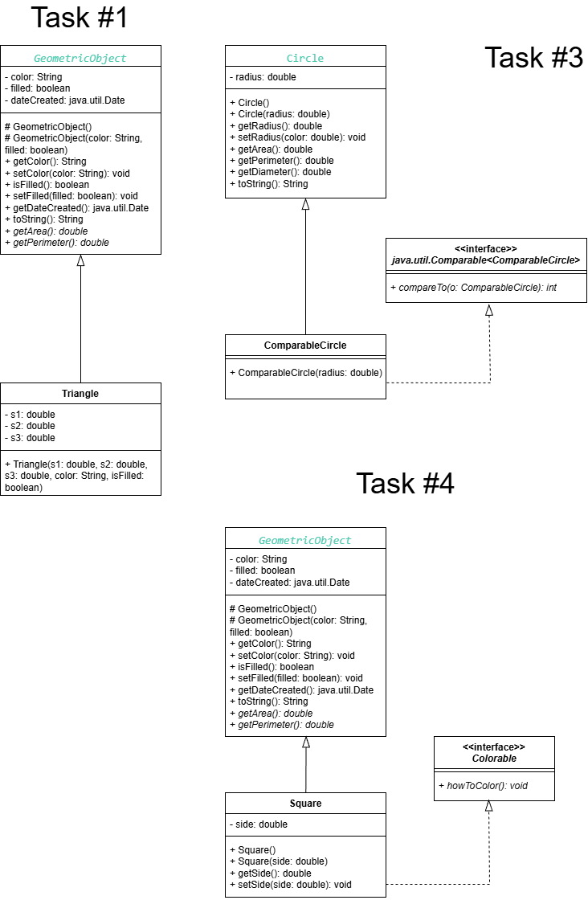

# JAVA Labs (Object Oriented Programming Course 953231)
### Lab 1 - Java Review
- [Instruction](https://mango-cmu.instructure.com/courses/25143/assignments/155197)
- __File__
    - [AprilFoolResolution.java](/src/Lab1/AprilFoolResolution.java)
    - [ReviewArray.java](/src/Lab1/ReviewArray.java)
### Lab 2 - Object and Class
- [Instruction](https://mango-cmu.instructure.com/courses/25143/assignments/155364)
- __File__
    1. Car
        - Class: [Car.java](/src/Lab2/Car/Car.java)
        - Execution: [MyCar.java](/src/Lab2/Car/MyCar.java)
    2. Dog
        - Class: [Dog.java](/src/Lab2/Dog/Dog.java)
        - Execution: [MyDog.java](/src/Lab2/Dog/MyDog.java)
    3. Rectangle
        - Class: [Rectangle.java](/src/Lab2/Rectangle/Rectangle.java)
        - Execution: [MyRectangle.java](/src/Lab2/Rectangle/MyRectangle.java)
### Lab 3 - OO Thinking
- [Instruction](https://mango-cmu.instructure.com/courses/25143/assignments/155773)
- __File__
    1. Aggregation
        - Class: [Address.java](/src/Lab3/AggregationExample/Address.java), [Student.java](/src/Lab3/AggregationExample/Student.java)
        - Execution: [TestAggregation.java](/src/Lab3/AggregationExample/TestAggregation.java)
        - Diagram 
        
    2. [StringManipulator.java](/src/Lab3/StringManipulator.java)
    3. [WrapperDemo.java](/src/Lab3/WrapperDemo.java)
### Lab 4 - Predefined Class and Methods
- [Instruction](https://mango-cmu.instructure.com/courses/25143/assignments/157571)
- __File__
    - [Lab4_Math.java](/src/Lab4/Lab4_Math.java)
    - [Lab4_Strings.java](/src/Lab4/Lab4_Strings.java)
    - [Lab4_Arrays.java](/src/Lab4/Lab4_Arrays.java)
### Lab 5 - Encapsulation
- [Instruction](https://mango-cmu.instructure.com/courses/25143/assignments/159130)
- __File__
    1. Stock
        - Class: [Stock.java](/src/Lab5/Stock/Stock.java)
        - Execution: [StockTest.java](/src/Lab5/Stock/StockTest.java)
        - Diagram 
        
    2. Counter
        - Class: [Counter.java](/src/Lab5/Counter/Counter.java)
        - Execution: [CounterTest.java](/src/Lab5/Counter/CounterTest.java)
### Lab 6 - Inheritance
- [Instruction](https://mango-cmu.instructure.com/courses/25143/assignments/160967)
- __File__
    1. [Bank](/src/Lab6/Bank/)
    2. [University](/src/Lab6/Uni/) (Diagram Below)  
    
### [Midterm Review](./src/Midterm.java)
- **Topics excluded:** UML Diagram, Class Relationships, Built-in Classes
### Lab 7 - Polymorphism
- [Instruction](https://mango-cmu.instructure.com/courses/25143/assignments/165971)
- __File__
    - [Publishing.java](/src/Lab7/Publishing.java) (Diagram Below)  
    
    - [Calculator.java](/src/Lab7/Calculator.java)
    - [AnimalNDog.java](/src/Lab7/AnimalNDog.java)
### Lab 8 - Abstract Class & Interface
- [Instruction](https://mango-cmu.instructure.com/courses/25143/assignments/166633)
- __File__
    - Task1: [Triangle.java](/src/Lab8/Triangle.java)
    - Task2: [SortArrayList.java](/src/Lab8/SortArrayList.java)
    - Task3: [ComparableCircle.java](/src/Lab8/ComparableCircle.java)
    - Task4: [InterfacePractice.java](/src/Lab8/InterfacePractice.java)
    
### Lab 9 - Generics
- [Instruction](https://mango-cmu.instructure.com/courses/25143/assignments/168451)
- __File__
    - [GenericStack.java](/src/Lab9/GenericStack.java)
    - [ArrayListMethods.java](/src/Lab9/ArrayListMethods.java)
### Lab 10 - Exceptions
- [Instruction](https://mango-cmu.instructure.com/courses/25143/assignments/170143)
- __File__
    - [InputMismatchException.java](/src/Lab10/InputMismatchException.java)
    - [ArrayIndexOutOfBoundsException.java](/src/Lab10/ArrayIndexOutOfBoundsException.java)
    - [IllegalTriangleException.java](/src/Lab10/IllegalTriangleException.java)
### Lab 11 - Java IO
- [Instruction](https://mango-cmu.instructure.com/courses/25143/assignments/171508)
- __File__
    - [WriteReadFile.java](/src/Lab11/WriteReadFile.java)
    - [ProcesStore.java](/src/Lab11/ProcessScore.java)