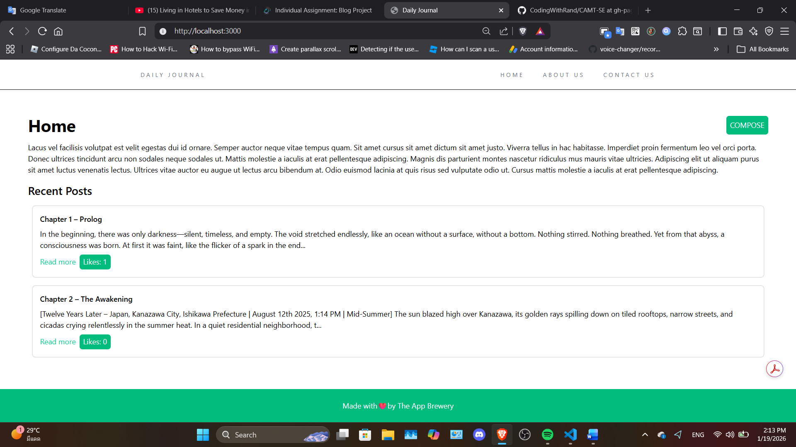

# A generic blog web app
I planned to add more features in the future. But this is the base template from individual assignment of the course 953621, CAMT, CMU.
## Stacks
- Vanilla HTML, CSS, JavaScript (bundled with esbuild) for frontend.
- TypeScript, Node.js, Express.js, EJS (SSR) for backend.
- Supabase for database

Disclaimer: This project is 50% vibe coded (The UI)

# Versions
## v1.0.0
Pretty much what I submitted to professor. This version is long gone...

This is what it looked like. Pretty simple.


## v2.0.0 (Not out yet)
Completely rebranded blog that works in the real world and deployed to [Render](https://render.com)

# TODO
1. Language preference ✓
2. Functional Contact page. ✓
3. Final check.

Problem:
- Unstable auth, can log out every reload + 401. -> try migrate from session to jwt cookie.

I tried docker. Here is the take away.
- `.devcontainer` is for deving and testing, use with vscode. features are optional.
- to push to docker hub, build one by yourself with [dockerfile](./dockerfile) as a config.
```bash
# Build command (docker build -t image_name dockerfile_lookup_dir)
docker build -t rand0mtutorial/camt-se-blog-web:latest .
# Run command (docker run -p host_port:in_container_using_port image_name)
docker run -p 3000:3000 rand0mtutorial/camt-se-blog-web:latest
# Publish to docker hub (Soon)
```